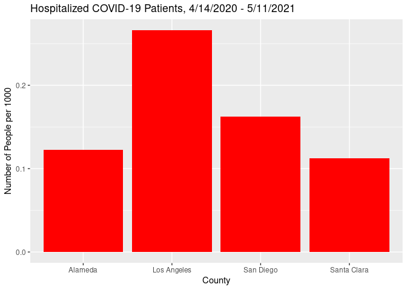

Data Wrangling and Visualization with Tidyverse
================

This workshop is about how to use the tidyverse. The tidyverse is a set
of R libraries that improve the R programmer’s ability to do data
analysis. The eight libraries that are a part of the tidyverse are
listed below, along with their purposes:

readr: Provides functions for reading in data of various file
formats<br> dplyr: Provides functions for processing and manipulating
data<br> tidyr: Provides functions for tidying unstructured data
(essentially an extension of dplyr)<br> tibble: Provides an alternative
data type to base R’s data.frame object<br> ggplot2: Provides functions
for making aesthetic data visualizations<br> stringr: Provides functions
for working with strings<br> forcats: Provides functions for working
with factors (categorical variables)<br> purrr: Provides functions for
functional programming

We will mainly focus on using the tidyverse for data wrangling and
visualization, two very important tasks that data scientists do. Hence,
we will mainly use the dplyr and ggplot2 libraries, along with some
functions in the tidyr and stringr libraries. This workshop assumes that
you already have basic knowledge of R programming.

``` r
library(dplyr)
library(stringr)
library(tidyr)
library(ggplot2)
```

For this workshop, we will use two datasets. The first dataset describes
the hospitalization of COVID-19 patients on a daily basis in each county
in California, while the second dataset describes the sheltering of
homeless people in each California county during the pandemic. Both
datasets can be found at the links below:

Hospital dataset:
<https://data.ca.gov/dataset/covid-19-hospital-data1/resource/0d9be83b-5027-41ff-97b2-6ca70238d778>

Homeless dataset:
<https://data.ca.gov/dataset/covid-19-homeless-impact/resource/235466b6-0eb9-4ff7-a4b4-8138f474ce83>

Both datasets were downloaded for use in this workshop on May 14, 2021
at 10:45 PM Pacific Time. The versions of the datasets used in this
workshop can be found in the GitHub repository. If you were to access
the datasets using the links above, you would find updated versions of
both datasets.

In this code block, we read in both datasets.

``` r
hospital <- read.csv("hospital.csv")
homeless <- read.csv("homeless.csv")
```

The `str` function gives us details about each dataset.

``` r
str(hospital)
```

    ## 'data.frame':    23013 obs. of  9 variables:
    ##  $ county                               : Factor w/ 56 levels "Alameda","Amador",..: 53 54 8 50 52 47 4 28 13 11 ...
    ##  $ todays_date                          : Factor w/ 411 levels "2020-03-29","2020-03-30",..: 1 1 1 1 1 1 1 1 1 1 ...
    ##  $ hospitalized_covid_confirmed_patients: num  1 24 0 0 6 7 NA 23 NA 1 ...
    ##  $ hospitalized_suspected_covid_patients: num  5 85 6 0 13 20 NA NA NA 10 ...
    ##  $ hospitalized_covid_patients          : num  NA NA NA NA NA NA NA NA NA NA ...
    ##  $ all_hospital_beds                    : num  NA NA NA NA NA NA NA NA NA NA ...
    ##  $ icu_covid_confirmed_patients         : num  0 5 0 0 5 2 NA 1 NA 0 ...
    ##  $ icu_suspected_covid_patients         : num  0 19 3 0 3 5 NA 0 NA 0 ...
    ##  $ icu_available_beds                   : num  0 14 3 2 7 12 NA 3 NA 18 ...

``` r
str(homeless)
```

    ## 'data.frame':    13663 obs. of  7 variables:
    ##  $ county                    : Factor w/ 174 levels "Alameda","Alameda ",..: 1 4 7 11 14 17 20 23 26 29 ...
    ##  $ date                      : Factor w/ 228 levels "2020-04-14T00:00:00",..: 1 1 1 1 1 1 1 1 1 1 ...
    ##  $ rooms                     : num  403 NA NA 65 NA NA 340 NA NA 305 ...
    ##  $ rooms_occupied            : num  115 NA NA 65 NA NA NA NA NA 250 ...
    ##  $ trailers_requested        : num  91 NA NA NA NA NA NA NA NA 28 ...
    ##  $ trailers_delivered        : num  85 NA NA NA NA NA NA NA NA NA ...
    ##  $ donated_trailers_delivered: num  NA NA NA NA NA NA NA NA NA NA ...

From the outputs above, we can identify two problems. The first problem
is that in both datasets, the date column is of the factor data type
instead of the Date data type. The second problem is that although there
are 58 counties in California, the hospital dataset only has information
on 56 counties, while the homeless dataset supposedly has information on
174 counties.

The line below shows the unique values of the `county` column of the
hospital dataset, sorted in alphabetical order.

``` r
sort(unique(hospital$county))
```

    ##  [1] Alameda         Amador          Butte           Calaveras      
    ##  [5] Colusa          Contra Costa    Del Norte       El Dorado      
    ##  [9] Fresno          Glenn           Humboldt        Imperial       
    ## [13] Inyo            Kern            Kings           Lake           
    ## [17] Lassen          Los Angeles     Madera          Marin          
    ## [21] Mariposa        Mendocino       Merced          Modoc          
    ## [25] Mono            Monterey        Napa            Nevada         
    ## [29] Orange          Placer          Plumas          Riverside      
    ## [33] Sacramento      San Benito      San Bernardino  San Diego      
    ## [37] San Francisco   San Joaquin     San Luis Obispo San Mateo      
    ## [41] Santa Barbara   Santa Clara     Santa Cruz      Shasta         
    ## [45] Siskiyou        Solano          Sonoma          Stanislaus     
    ## [49] Sutter          Tehama          Trinity         Tulare         
    ## [53] Tuolumne        Ventura         Yolo            Yuba           
    ## 56 Levels: Alameda Amador Butte Calaveras Colusa Contra Costa ... Yuba

We can see above that Alpine and Sierra counties are not included in the
hospital dataset. This should not be a huge issue because these are the
smallest counties in California by population.

Notice above that we applied two functions to `hospital$county`
sequentially. We first used the `unique` function to get the distinct
values in the column, and then used the `sort` function to sort the
distinct values in alphabetical order. Sometimes, we will need to
sequentially apply several functions to vectors or dataframes, and it
may be hard to read or understand the resulting code if we do this the
normal way in R. The dplyr library provides the pipe operator `%>%` to
apply functions sequentially in a more readable manner. The following
two lines are equivalent.

`func4(func3(func2(func1(data))))`

`data %>% func1 %>% func2 %>% func3 %>% func4`

The line below shows the unique values of the `county` column of the
homeless dataset, sorted in alphabetical order.

``` r
homeless$county %>% unique %>% sort
```

    ##   [1] Alameda                      Alameda                     
    ##   [3] Alameda County               Alpine                      
    ##   [5] Alpine                       Alpine County               
    ##   [7] Amador                       Amador                      
    ##   [9] Amador County                Bishop Paiute Tribal Council
    ##  [11] Butte                        Butte                       
    ##  [13] Butte County                 Calaveras                   
    ##  [15] Calaveras                    Calaveras County            
    ##  [17] Colusa                       Colusa                      
    ##  [19] Colusa County                Contra Costa                
    ##  [21] Contra Costa                 Contra Costa County         
    ##  [23] Del Norte                    Del Norte                   
    ##  [25] Del Norte County             El Dorado                   
    ##  [27] El Dorado                    El Dorado County            
    ##  [29] Fresno                       Fresno                      
    ##  [31] Fresno County                Glenn                       
    ##  [33] Glenn                        Glenn County                
    ##  [35] Hoopa Valley Tribe           Humboldt                    
    ##  [37] Humboldt County              Imperial                    
    ##  [39] Imperial                     Imperial County             
    ##  [41] Inyo                         Inyo                        
    ##  [43] Inyo County                  Kern                        
    ##  [45] Kern                         Kern County                 
    ##  [47] Kings                        Kings                       
    ##  [49] Kings County                 Lake                        
    ##  [51] Lake                         Lake County                 
    ##  [53] Lassen                       Lassen                      
    ##  [55] Lassen County                Los Angeles                 
    ##  [57] Los Angeles                  Los Angeles County          
    ##  [59] Madera                       Madera                      
    ##  [61] Madera County                Marin                       
    ##  [63] Marin                        Marin County                
    ##  [65] Mariposa                     Mariposa                    
    ##  [67] Mariposa County              Mendocino                   
    ##  [69] Mendocino                    Mendocino County            
    ##  [71] Merced                       Merced                      
    ##  [73] Merced County                Modoc                       
    ##  [75] Modoc                        Modoc County                
    ##  [77] Mono                         Mono                        
    ##  [79] Mono County                  Monterey                    
    ##  [81] Monterey                     Monterey County             
    ##  [83] Napa                         Napa                        
    ##  [85] Napa County                  Nevada                      
    ##  [87] Nevada                       Nevada County               
    ##  [89] Orange                       Orange                      
    ##  [91] Orange County                Placer                      
    ##  [93] Placer                       Placer County               
    ##  [95] Plumas                       Plumas                      
    ##  [97] Plumas County                Riverside                   
    ##  [99] Riverside                    Riverside County            
    ## [101] Sacramento                   Sacramento                  
    ## [103] Sacramento County            San Benito                  
    ## [105] San Benito                   San Benito County           
    ## [107] San Bernardino               San Bernardino              
    ## [109] San BernardinoCounty         San Diego                   
    ## [111] San Diego                    San Diego County            
    ## [113] San Francisco                San Joaquin                 
    ## [115] San Joaquin                  San Joaquin County          
    ## [117] San Luis Obispo              San Luis Obispo             
    ## [119] San Luis Obispo County       San Mateo                   
    ## [121] San Mateo                    San Mateo County            
    ## [123] Santa Barbara                Santa Barbara               
    ## [125] Santa Barbara County         Santa Clara                 
    ## [127] Santa Clara                  Santa Clara County          
    ## [129] Santa Cruz                   Santa Cruz                  
    ## [131] Santa Cruz County            Shasta                      
    ## [133] Shasta                       Shasta County               
    ## [135] Sierra                       Sierra                      
    ## [137] Sierra County                Siskiyou                    
    ## [139] Siskiyou                     Siskiyou County             
    ## [141] Solano                       Solano                      
    ## [143] Solano County                Sonoma                      
    ## [145] Sonoma                       Sonoma County               
    ## [147] Stanislaus                   Stanislaus                  
    ## [149] Stanislaus County            Sutter                      
    ## [151] Sutter                       Sutter County               
    ## [153] Tehama                       Tehama                      
    ## [155] Tehama County                Trinity                     
    ## [157] Trinity                      Trinity County              
    ## [159] Tulare                       Tulare                      
    ## [161] Tulare County                Tuolumne                    
    ## [163] Tuolumne County              Ventura                     
    ## [165] Ventura                      Ventura County              
    ## [167] Wilton Rancheria             Wilton Rancheria Tribe      
    ## [169] Yolo                         Yolo                        
    ## [171] Yolo County                  Yuba                        
    ## [173] Yuba                         Yuba County                 
    ## 174 Levels: Alameda Alameda  Alameda County Alpine Alpine  ... Yuba County

We can see above that there are so many unique values in the `county`
column because the homeless dataset does not follow a consistent
formatting for county names. In some rows, the value in the `county`
column only has the county name, while in other rows, the values have
trailing whitespace (i.e. the values end with whitespace), while yet in
other rows, the values end with “County”. Furthermore, the `county`
column includes tribal councils.

We can use two functions from the stringr library to clean up the values
in the `county` column. The `str_remove` function removes the first
instance of the specified string, if there is any, from every value in
the vector it is applied to. The `str_trim` function removes leading and
trailing whitespace from every value in the vector it is applied to.

The line below shows the unique values of the `county` column of the
homeless dataset, sorted in alphabetical order, after removing instances
of “County” and trailing whitespace.

``` r
homeless$county %>% str_remove("County") %>% str_trim %>% unique %>% sort
```

    ##  [1] "Alameda"                      "Alpine"                      
    ##  [3] "Amador"                       "Bishop Paiute Tribal Council"
    ##  [5] "Butte"                        "Calaveras"                   
    ##  [7] "Colusa"                       "Contra Costa"                
    ##  [9] "Del Norte"                    "El Dorado"                   
    ## [11] "Fresno"                       "Glenn"                       
    ## [13] "Hoopa Valley Tribe"           "Humboldt"                    
    ## [15] "Imperial"                     "Inyo"                        
    ## [17] "Kern"                         "Kings"                       
    ## [19] "Lake"                         "Lassen"                      
    ## [21] "Los Angeles"                  "Madera"                      
    ## [23] "Marin"                        "Mariposa"                    
    ## [25] "Mendocino"                    "Merced"                      
    ## [27] "Modoc"                        "Mono"                        
    ## [29] "Monterey"                     "Napa"                        
    ## [31] "Nevada"                       "Orange"                      
    ## [33] "Placer"                       "Plumas"                      
    ## [35] "Riverside"                    "Sacramento"                  
    ## [37] "San Benito"                   "San Bernardino"              
    ## [39] "San Diego"                    "San Francisco"               
    ## [41] "San Joaquin"                  "San Luis Obispo"             
    ## [43] "San Mateo"                    "Santa Barbara"               
    ## [45] "Santa Clara"                  "Santa Cruz"                  
    ## [47] "Shasta"                       "Sierra"                      
    ## [49] "Siskiyou"                     "Solano"                      
    ## [51] "Sonoma"                       "Stanislaus"                  
    ## [53] "Sutter"                       "Tehama"                      
    ## [55] "Trinity"                      "Tulare"                      
    ## [57] "Tuolumne"                     "Ventura"                     
    ## [59] "Wilton Rancheria"             "Wilton Rancheria Tribe"      
    ## [61] "Yolo"                         "Yuba"

That’s much better. We can see that the unique values are the 58
counties in California, along with a few tribal councils. We can remove
rows in the homeless dataset corresponding to tribal councils.

Below, we modify the two datasets to solve the issues we discovered
earlier. For the homeless dataset, we first use dplyr’s `filter`
function to only keep rows where the value in the `county` column is not
a tribal council. Then, we use dplyr’s `mutate` function to change the
`county` column by removing instances of “County” and trailing
whitespace, and to change the `date` column’s data type from factor to
Date. Similarly, for the hospital dataset, we change the `todays_date`
column’s data type from factor to Date.

Note that functions like `filter` and `mutate` do not change the dataset
itself, but instead return a copy of the dataset with the applied
changes.

``` r
tribes <- c("Bishop Paiute Tribal Council", "Hoopa Valley Tribe", "Wilton Rancheria",
            "Wilton Rancheria Tribe")
homeless <- homeless %>% filter(!(county %in% tribes)) %>%
  mutate(county = county %>% str_remove("County") %>% str_trim, date = as.Date(date))
hospital <- hospital %>% mutate(todays_date = as.Date(todays_date))
```

Here, we find the range of dates in the hospital dataset, as well as the
number of unique dates.

``` r
print(paste("First Date:", min(hospital$todays_date)))
print(paste("Last Date:", max(hospital$todays_date)))
print(paste("Number of Days:", length(unique(hospital$todays_date))))
```

    ## [1] "First Date: 2020-03-29"
    ## [1] "Last Date: 2021-05-13"
    ## [1] "Number of Days: 411"

We can see that the hospital dataset contains every date in the range of
March 29, 2020 to May 13, 2021. Now we will find the range of dates in
the homeless dataset, as well as the number of unique dates.

``` r
print(paste("First Date:", min(homeless$date)))
print(paste("Last Date:", max(homeless$date)))
print(paste("Number of Days:", length(unique(homeless$date))))
```

    ## [1] "First Date: 2020-04-14"
    ## [1] "Last Date: 2021-05-11"
    ## [1] "Number of Days: 228"

We can see that the homeless dataset contains a majority of the dates
between April 14, 2020 and May 11, 2021. This is not ideal, but it
should not be a big problem.

We check the range of dates in the two datasets to see if it would be
sensible to combine the two datasets. We may want to do this if we want
to see any relationship between COVID-19 hospitalizations and sheltering
of homeless people in California, or to compare them.

We can combine the two datasets using a join on county and date. When we
do this, each row in the resulting dataset will have the county, the
date, the information on COVID-19 hospitalization on the given date in
the specified county, and the information on homeless sheltering on the
given date in the specified county. Note that in both datasets, each
combination of county and date appears exactly once, which is ideal for
joins. The combinations of county and date, along with the corresponding
information on COVID-19 hospitalization and homeless sheltering, that
appear in the resulting dataset, depend on the type of join we do.

An inner join will only contain the combinations of county and date that
appear in both datasets. A left outer join will contain the combinations
of county and date that appear in the hospital dataset (assuming we are
joining the hospital dataset with the homeless dataset, not the other
way around). A right outer join will contain the combinations of county
and date that appear in the homeless dataset. A full outer join will
contain all combinations of county and date that appear in either
dataset. In a left or full outer join, if a combination of county and
date does not appear in the homeless dataset, then for the corresponding
row of the resulting dataset, the columns from the homeless dataset
(other than `county` and `date`) will be filled with null values.
Likewise, in a right or full outer join, if a combination of county and
date does not appear in the hospital dataset, then for the corresponding
row of the resulting dataset, the columns from the hospital dataset will
be filled with null values.

Here, we combine the hospital and homeless datasets by doing an inner
join on county and date. Note that in both datasets, the county
information is stored in the `county` column. However, in the hospital
dataset, the date information is stored in the `todays_date` column,
while in the homeless dataset, the date information is stored in the
`date` column. That is why we set `by = c("county", "todays_date" =
"date")`, not `by = c("county" = "county", "todays_date" = "date")` or
`by = c("county", "date")`.

``` r
joined <- hospital %>%
  inner_join(homeless, by = c("county", "todays_date" = "date"))
str(joined)
```

    ## 'data.frame':    12768 obs. of  14 variables:
    ##  $ county                               : chr  "Stanislaus" "Colusa" "Sutter" "Placer" ...
    ##  $ todays_date                          : Date, format: "2020-04-14" "2020-04-14" ...
    ##  $ hospitalized_covid_confirmed_patients: num  18 0 0 17 92 3 0 10 0 55 ...
    ##  $ hospitalized_suspected_covid_patients: num  25 0 0 15 106 15 0 156 3 12 ...
    ##  $ hospitalized_covid_patients          : num  NA NA NA NA NA NA NA NA NA NA ...
    ##  $ all_hospital_beds                    : num  NA NA NA NA NA NA NA NA NA NA ...
    ##  $ icu_covid_confirmed_patients         : num  9 0 NA 5 34 2 0 0 0 19 ...
    ##  $ icu_suspected_covid_patients         : num  7 0 NA 4 21 6 0 1 0 4 ...
    ##  $ icu_available_beds                   : num  50 6 NA 9 61 18 NA 5 3 25 ...
    ##  $ rooms                                : num  NA NA 16 15 403 154 NA NA NA 94 ...
    ##  $ rooms_occupied                       : num  NA NA 16 15 115 NA NA NA NA 94 ...
    ##  $ trailers_requested                   : num  NA NA NA NA 91 14 NA NA NA NA ...
    ##  $ trailers_delivered                   : num  NA NA NA NA 85 14 NA NA NA NA ...
    ##  $ donated_trailers_delivered           : num  NA NA NA NA NA NA NA NA NA NA ...

Sometimes, the `str` function might not be enough to give us a
sufficient understanding of the dataset. We therefore use the `head`
function to look at the top few rows of the joined dataset.

``` r
head(joined)
```

    ##            county todays_date hospitalized_covid_confirmed_patients
    ## 1      Stanislaus  2020-04-14                                    18
    ## 2          Colusa  2020-04-14                                     0
    ## 3          Sutter  2020-04-14                                     0
    ## 4          Placer  2020-04-14                                    17
    ## 5         Alameda  2020-04-14                                    92
    ## 6 San Luis Obispo  2020-04-14                                     3
    ##   hospitalized_suspected_covid_patients hospitalized_covid_patients
    ## 1                                    25                          NA
    ## 2                                     0                          NA
    ## 3                                     0                          NA
    ## 4                                    15                          NA
    ## 5                                   106                          NA
    ## 6                                    15                          NA
    ##   all_hospital_beds icu_covid_confirmed_patients icu_suspected_covid_patients
    ## 1                NA                            9                            7
    ## 2                NA                            0                            0
    ## 3                NA                           NA                           NA
    ## 4                NA                            5                            4
    ## 5                NA                           34                           21
    ## 6                NA                            2                            6
    ##   icu_available_beds rooms rooms_occupied trailers_requested trailers_delivered
    ## 1                 50    NA             NA                 NA                 NA
    ## 2                  6    NA             NA                 NA                 NA
    ## 3                 NA    16             16                 NA                 NA
    ## 4                  9    15             15                 NA                 NA
    ## 5                 61   403            115                 91                 85
    ## 6                 18   154             NA                 14                 14
    ##   donated_trailers_delivered
    ## 1                         NA
    ## 2                         NA
    ## 3                         NA
    ## 4                         NA
    ## 5                         NA
    ## 6                         NA

There is a concerning amount of null values in the dataset, especially
since we did an inner join. We should figure out how to replace these
null values with actual numbers.

We see that there are null values in the `hospitalized_covid_patients`,
even in rows where `hospitalized_covid_confirmed_patients` and
`hospitalized_suspected_covid_patients` are not null. It is possible
that `hospitalized_covid_patients` is simply the sum of
`hospitalized_covid_confirmed_patients` and
`hospitalized_suspected_covid_patients`, and we investigate this below.

``` r
joined %>% filter(!is.na(hospitalized_covid_patients)) %>% head
```

    ##       county todays_date hospitalized_covid_confirmed_patients
    ## 1  Riverside  2020-04-21                                   250
    ## 2      Modoc  2020-04-21                                     0
    ## 3     Nevada  2020-04-21                                     1
    ## 4 Stanislaus  2020-04-21                                    11
    ## 5   Monterey  2020-04-21                                     7
    ## 6 Santa Cruz  2020-04-21                                     3
    ##   hospitalized_suspected_covid_patients hospitalized_covid_patients
    ## 1                                   120                         370
    ## 2                                     1                           1
    ## 3                                     4                           5
    ## 4                                    20                          31
    ## 5                                     4                          11
    ## 6                                     2                           5
    ##   all_hospital_beds icu_covid_confirmed_patients icu_suspected_covid_patients
    ## 1              2726                           81                           32
    ## 2                20                            0                            0
    ## 3                58                            1                            2
    ## 4              1400                            4                            7
    ## 5               875                            2                            1
    ## 6               351                            1                            0
    ##   icu_available_beds rooms rooms_occupied trailers_requested trailers_delivered
    ## 1                112   422            303                 15                 15
    ## 2                 NA    NA             NA                 NA                 NA
    ## 3                  7    27             NA                 NA                 NA
    ## 4                 72   121             NA                 NA                 NA
    ## 5                 68    NA             NA                108                 15
    ## 6                 16    27             20                 35                 NA
    ##   donated_trailers_delivered
    ## 1                         NA
    ## 2                         NA
    ## 3                         NA
    ## 4                         NA
    ## 5                         NA
    ## 6                         NA

As suspected, `hospitalized_covid_patients` is the sum of
`hospitalized_covid_confirmed_patients` and
`hospitalized_suspected_covid_patients`. Regarding the other columns, it
might make sense to replace null values with zeros, since a null value
in a column might mean that there was no quantity of the specified item
for the given date and county. For example, there are many null values
in the `donated_trailers_delivered` column because no one donated any
trailers for the purpose of sheltering homeless people. It might not
always make sense to simply replace null values with zeros.

Below, we modify the joined dataset to handle the null values
appropriately. We are using dplyr’s `mutate_if` function to replace null
values with zeros in all numeric columns. The `mutate_if` function is a
scoped variant of the `mutate` function that modifies all columns that
satisfy a certain condition (in this case, `is.numeric`) using the same
function. The dot operator `.` signifies all columns that satisfy the
condition, and we use it with the tilde operator `~`. The other scoped
variants of the `mutate` function are the `mutate_at` function (for
modifying specified columns) and the `mutate_all` function (for
modifying all columns).

``` r
joined <- joined %>% mutate_if(is.numeric, ~ifelse(is.na(.), 0, .)) %>%
  mutate(hospitalized_covid_patients = hospitalized_covid_confirmed_patients +
           hospitalized_suspected_covid_patients)
head(joined)
```

    ##            county todays_date hospitalized_covid_confirmed_patients
    ## 1      Stanislaus  2020-04-14                                    18
    ## 2          Colusa  2020-04-14                                     0
    ## 3          Sutter  2020-04-14                                     0
    ## 4          Placer  2020-04-14                                    17
    ## 5         Alameda  2020-04-14                                    92
    ## 6 San Luis Obispo  2020-04-14                                     3
    ##   hospitalized_suspected_covid_patients hospitalized_covid_patients
    ## 1                                    25                          43
    ## 2                                     0                           0
    ## 3                                     0                           0
    ## 4                                    15                          32
    ## 5                                   106                         198
    ## 6                                    15                          18
    ##   all_hospital_beds icu_covid_confirmed_patients icu_suspected_covid_patients
    ## 1                 0                            9                            7
    ## 2                 0                            0                            0
    ## 3                 0                            0                            0
    ## 4                 0                            5                            4
    ## 5                 0                           34                           21
    ## 6                 0                            2                            6
    ##   icu_available_beds rooms rooms_occupied trailers_requested trailers_delivered
    ## 1                 50     0              0                  0                  0
    ## 2                  6     0              0                  0                  0
    ## 3                  0    16             16                  0                  0
    ## 4                  9    15             15                  0                  0
    ## 5                 61   403            115                 91                 85
    ## 6                 18   154              0                 14                 14
    ##   donated_trailers_delivered
    ## 1                          0
    ## 2                          0
    ## 3                          0
    ## 4                          0
    ## 5                          0
    ## 6                          0

Here, we create a new dataset consisting of all of the rows in the
joined dataset corresponding to Yolo County.

``` r
joined_yolo <- joined %>% filter(county == "Yolo")
head(joined_yolo)
```

    ##   county todays_date hospitalized_covid_confirmed_patients
    ## 1   Yolo  2020-04-14                                     3
    ## 2   Yolo  2020-04-15                                     2
    ## 3   Yolo  2020-04-16                                     2
    ## 4   Yolo  2020-04-17                                     4
    ## 5   Yolo  2020-04-18                                     4
    ## 6   Yolo  2020-04-19                                     6
    ##   hospitalized_suspected_covid_patients hospitalized_covid_patients
    ## 1                                     0                           3
    ## 2                                     1                           3
    ## 3                                     1                           3
    ## 4                                     0                           4
    ## 5                                     0                           4
    ## 6                                     0                           6
    ##   all_hospital_beds icu_covid_confirmed_patients icu_suspected_covid_patients
    ## 1                 0                            2                            0
    ## 2                 0                            2                            0
    ## 3                 0                            1                            0
    ## 4                 0                            1                            0
    ## 5                 0                            1                            0
    ## 6                 0                            0                            0
    ##   icu_available_beds rooms rooms_occupied trailers_requested trailers_delivered
    ## 1                 12   146            119                  0                  0
    ## 2                 14   146            119                  0                  0
    ## 3                 15   246            206                  0                  0
    ## 4                 14   246            206                  0                  0
    ## 5                 14   246            206                  0                  0
    ## 6                 21   246            206                  0                  0
    ##   donated_trailers_delivered
    ## 1                          0
    ## 2                          0
    ## 3                          0
    ## 4                          0
    ## 5                          0
    ## 6                          0

We see that there are many columns in the resulting dataset. We will not
need all of the columns, so we use dplyr’s `select` function to keep
only the `todays_date`, `hospitalized_covid_patients`, and
`rooms_occupied` columns.

``` r
joined_yolo <- joined_yolo %>% select(todays_date, hospitalized_covid_patients,
                                      rooms_occupied)
head(joined_yolo)
```

    ##   todays_date hospitalized_covid_patients rooms_occupied
    ## 1  2020-04-14                           3            119
    ## 2  2020-04-15                           3            119
    ## 3  2020-04-16                           3            206
    ## 4  2020-04-17                           4            206
    ## 5  2020-04-18                           4            206
    ## 6  2020-04-19                           6            206

Now that we have the data we need, we make our first plot using ggplot2.
This will be a line plot that tracks the number of COVID-19 patients in
hospitals in Yolo County per day. We use the `aes` object to specify
that the x axis should be the `todays_date` column and the y axis should
be the `hospitalized_covid_patients` column. We use `geom_line` as
follows to indicate that we want to create a line plot.

``` r
joined_yolo %>% ggplot(aes(x = todays_date, y = hospitalized_covid_patients)) + geom_line()
```

<!-- -->

The plot above can certainly be enhanced. One way we can make our plot
better is by setting our own axis labels and title. We can also include
a line that tracks the number of rooms occupied by homeless people in
Yolo County.

The easiest way to include information on homeless sheltering is
combining the `hospitalized_covid_patients` and `rooms_occupied` columns
into one column and using another column to track whether the number in
the row corresponds to the number of hospitalized COVID patients or the
number of shelter rooms occupied. We can do this using tidyr’s `gather`
function.

If we apply the `gather` to a dataframe with \(r\) rows and \(c\)
columns, the resulting dataframe has \(r * c\) rows and 2 columns: a key
column and a value column. For each block of \(c\) rows, the key column
has the names of the columns of the original dataframe, and the value
column has the values of each column corresponding to one of the rows in
the original dataframe.

The results of using the `gather` function on the Yolo County dataset
are shown below. The `category` column is the key column, and the
`number_people` column is the value column. We include `-todays_date` to
prevent the `todays_date` column from being gathered.

``` r
joined_yolo_gather <- joined_yolo %>% gather(category, number_people, -todays_date)
rbind(head(joined_yolo_gather),
      head(joined_yolo_gather %>% filter(category == "rooms_occupied")))
```

    ##    todays_date                    category number_people
    ## 1   2020-04-14 hospitalized_covid_patients             3
    ## 2   2020-04-15 hospitalized_covid_patients             3
    ## 3   2020-04-16 hospitalized_covid_patients             3
    ## 4   2020-04-17 hospitalized_covid_patients             4
    ## 5   2020-04-18 hospitalized_covid_patients             4
    ## 6   2020-04-19 hospitalized_covid_patients             6
    ## 7   2020-04-14              rooms_occupied           119
    ## 8   2020-04-15              rooms_occupied           119
    ## 9   2020-04-16              rooms_occupied           206
    ## 10  2020-04-17              rooms_occupied           206
    ## 11  2020-04-18              rooms_occupied           206
    ## 12  2020-04-19              rooms_occupied           206

tidyr’s `spread` function reverses the effect of the `gather` function.
When using the `spread` function, make sure that the dataframe is in the
appropriate format first. The results of using the `spread` function on
the gathered Yolo County dataset are shown below.

``` r
joined_yolo_spread <- joined_yolo_gather %>% spread(category, number_people)
head(joined_yolo_spread)
```

    ##   todays_date hospitalized_covid_patients rooms_occupied
    ## 1  2020-04-14                           3            119
    ## 2  2020-04-15                           3            119
    ## 3  2020-04-16                           3            206
    ## 4  2020-04-17                           4            206
    ## 5  2020-04-18                           4            206
    ## 6  2020-04-19                           6            206

Below, we enhance our initial plot by adding axis labels and titles and
including another line to track the number of rooms occupied by homeless
people in Yolo County. We include `color = category` in the aesthetic
mapping to indicate that we want multiple lines: one for each unique
value in the `category` column. One line includes all points
corresponding to rows in the gathered Yolo County dataset where
`category` is “hospitalized\_covid\_patients”, while the other line
includes all points corresponding to rows in the gathered dataframe
where `category` is “rooms\_occupied”. The two lines will have different
colors.

``` r
joined_yolo_gather %>% ggplot(aes(x = todays_date, y = number_people, color = category)) +
  geom_line() + xlab("Date") + ylab("Number of People") +
  ggtitle("People in Yolo County Hospitalized with COVID-19 or Given Shelter")
```

<!-- -->

The legend takes up a lot of space in the plot above. We can improve the
visualization by moving the legend to the bottom using the `theme`
object. We can also use the `scale_color_manual` object to remove the
legend name, change the labels, and change the colors of the lines. The
resulting plot is shown below.

``` r
joined_yolo_gather %>% ggplot(aes(x = todays_date, y = number_people, color = category)) +
  geom_line() + xlab("Date") + ylab("Number of People") +
  ggtitle("People in Yolo County Hospitalized with COVID-19 or Given Shelter") +
  theme(legend.position = "bottom") +
  scale_color_manual(name = NULL, values = c("blue", "darkgreen"),
                     labels = c("Hospitalized COVID Patients",
                                "Sheltered Homeless People"))
```

<!-- -->

Clearly, in Yolo County, there were more people in homeless shelters
than in the hospital due to COVID-19 throughout the pandemic. From here,
we can continue with our analysis in several ways. One thing we can do
is take a closer look at our data to see why the data for 2020 is more
granular than the data in 2021. Another thing we can do is fit a
forecasting model on the hospital data and use it to predict the number
of COVID-19 patients in the hospitals in Yolo County during the
following week.

Here, we find the average number of hospitalized COVID-19 patients per
day for each county. We do so by using dplyr’s `group_by` function,
where we group by `county`, followed by dplyr’s `summarize_at` function.
As shown below, the second argument of the `summarize_at` is a `vars`
object that contains the variables we want to summarize, and the third
argument is the summarizing function we want to apply to the variables.
Without the `group_by` function, we would only get the mean of the
entire `hospitalized_covid_patients` column.

While the `summarize_at` function summarizes specific variables, the
`summarize_if` function summarizes all variables that satisfy a
condition, and the `summarize_all` function summarizes all variables.
The `summarize_at`, `summarize_if`, and `summarize_all` functions are
similar in syntax to the `mutate_at`, `mutate_if`, and `mutate_all`
functions, respectively. Notice that we do not use the tilde and dot
operators below. If the function is of the form `~func(.)`, we can
replace it with `func`, where `func` can be any function name.

``` r
joined_county <- joined %>% group_by(county) %>%
  summarize_at(vars(hospitalized_covid_patients), mean)
head(joined_county)
```

    ## # A tibble: 6 x 2
    ##   county       hospitalized_covid_patients
    ##   <chr>                              <dbl>
    ## 1 Alameda                           205.  
    ## 2 Amador                              3.12
    ## 3 Butte                              22.2 
    ## 4 Calaveras                           1.94
    ## 5 Colusa                              3.06
    ## 6 Contra Costa                      105.

Here, we make a bar plot that visualizes the average number of
hospitalized COVID-19 patients in the two largest counties in Southern
California, and the two largest in Northern California. These would be
Los Angeles, San Diego, Santa Clara, and Alameda counties. The code is
similar to the code for making a line plot, except we use `geom_col`
instead of `geom_line` to indicate that we want a bar plot. We can set
the color for the bars using the `fill` argument.

``` r
counties_of_interest <- c("Los Angeles", "San Diego", "Santa Clara", "Alameda")
joined_county %>% filter(county %in% counties_of_interest) %>%
  ggplot(aes(x = county, y = hospitalized_covid_patients)) +
  geom_col(fill = "red") + xlab("County") + ylab("Number of People") +
  ggtitle("Hospitalized COVID-19 Patients, 4/14/2020 - 5/11/2021")
```

<!-- -->

We can see above that on average, LA County has many more hospitalized
COVID-19 patients than the other counties. Depending on the purpose of
the visualization, this may lead to an unfair comparison since the bar
plot does not account for the fact that LA County has a much larger
population than the other counties. The dataframe below shows the
population of the four counties as of 2019.

``` r
county_pop_2019 <- data.frame("County" = sort(counties_of_interest),
                              "Population" = c(1671329, 10039107, 3338330, 1927952))
county_pop_2019
```

    ##        County Population
    ## 1     Alameda    1671329
    ## 2 Los Angeles   10039107
    ## 3   San Diego    3338330
    ## 4 Santa Clara    1927952

The code block below determines the average number of hospitalized
COVID-19 patients per 1,000 people in Alameda, LA, San Diego, and Santa
Clara counties, respectively. Note that since `hcp[joined_county$county
%in% counties_of_interest]` and `county_pop_2019$Population` are both
vectors with four elements, the kind of division being done is
element-wise division.

``` r
hcp <- joined_county$hospitalized_covid_patients
1000 * (hcp[joined_county$county %in% counties_of_interest] / county_pop_2019$Population)
```

    ## [1] 0.1226936 0.2661189 0.1627048 0.1121202

Now we make a bar plot that visualizes the average number of
hospitalized COVID-19 patients per capita in the four counties.

``` r
joined_county %>% filter(county %in% counties_of_interest) %>%
  mutate(hospitalized_covid_patients = 1000 *
           (hospitalized_covid_patients / county_pop_2019$Population)) %>%
  ggplot(aes(x = county, y = hospitalized_covid_patients)) +
  geom_col(fill = "red") + xlab("County") +
  ylab("Number of People per 1000") +
  ggtitle("Hospitalized COVID-19 Patients, 4/14/2020 - 5/11/2021")
```

<!-- -->

We can see above that even after adjusting for population, LA County
seems to have more hospitalized COVID-19 patients than the other
counties. From here, we can continue with our analysis in several ways.
One thing we can do is conduct a statistical test to confirm whether or
not LA County is doing significantly worse than the three other counties
in terms of minimizing COVID-19 hospitalizations. If we find that LA
County indeed is doing significantly worse, then we can look into why LA
County has more hospitalizations than the other counties by examining
other data sources.
